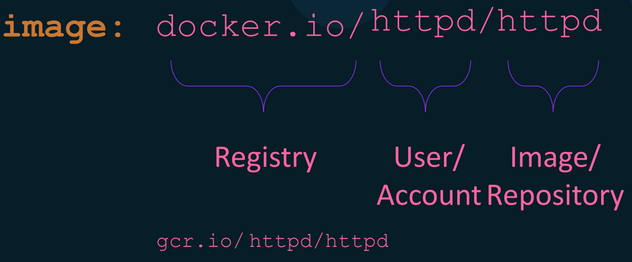

# 🚀Docker Cheat Sheet/CLI Commands🚀

## Let’s try some basic command 

1. This command is used to check the installed Docker version on your system.\
`sudo docker version`
2. Display system-wide information.\
`sudo docker info`
3. This command checks the status of the Docker service using systemd.\
`sudo systemctl status docker`
4. This command displays a list of currently running Docker containers.\
`sudo docker ps`
5. This command shows all containers, including those that are not currently running.\
`sudo docker ps -a`
6. This command lists all the Docker images that are available on your system.\
`sudo docker images`
7. This command pulls the latest version of the Nginx.\
`sudo docker run nginx`
8. The correct command to list running containers.\
`docker container list`\
*Additionally, using **sudo** might be necessary depending on your system's configuration.*
 ---

## Managing Docker Services and Sockets with Systemd

Docker service can still be activated through the Docker socket (`docker.socket`) even if you stop the Docker service (`docker.service`). The Docker socket allows communication with the Docker daemon and is used for Docker API access.

1. This command checks the status of the Docker service.\
`sudo systemctl status docker`
2. This command stops the Docker service.\
`sudo systemctl stop docker`
3. This command checks the status of the Docker service again.\
`sudo systemctl status docker`
4. This command stops the Docker socket.\
`sudo systemctl stop docker.socket`
5. This command checks the status of the Docker service once again.\
`sudo systemctl status docker`
---

## The lifecycle of a Docker container
The lifecycle of a Docker container involves creation, running, stopping, and removal. Containers are created from Docker images, run as isolated instances, can be stopped or paused, and can be removed when no longer needed.


Image: Lifecycle of a Docker container

**Example**

1. docker create:\
Purpose: Creates a new container but does not start it.\
Example:\
Creates a new container named "my-container" using the Nginx image but does not start it.\
`docker create --name my-container nginx`

2. docker start:\
Purpose: Starts one or more stopped containers.\
Example:\
Starts the container named "my-container" that was previously created but stopped.\
`docker start my-container`

3. docker run:\
Purpose: Creates and starts a new container in a single command.\
Example:\
This command combines the process of creating and starting a container named "my-container" using the Nginx image in a single step.\
`docker run --name my-container nginx`

4. docker pause:\
Purpose: Temporarily pause the processes in the running container.\
Example:
    ```bash
    docker pause my-container
    docker ps --filter "name=my-container"
    docker unpause my-container
    docker ps --filter "name=my-container"
    ```
5. docker stop:\
Purpose: The docker stop command is used to stop a running container.\
Example:\
This command stop a container named "my-container".\
`docker stop my-container`

6. docker rm:\
Purpose: The docker rm command is used to remove a container.\
Example:\
Want to remove container named "my-container".\
`docker rm my-container`

---

## Why a Docker container exits!!!
Docker containers are designed to run a specific command or process and exit when that command or process completes. The default behavior is to start the specified command or process inside the container and stop when that command or process finishes execution.\
Docker containers run as long as the process inside the container is active.\
Example:

Default Shell Behavior (Container Stops Immediately).\
`docker run busybox`

Run an Interactive Terminal (Container Remains Running).\
`docker run -it busybox`

Run a Command to Keep Container Running (e.g., Sleep). In the third example, the sleep 3600 command will keep the container running for 3600 seconds (1 hour), and then it will exit.\
`docker run busybox sleep 3600`

---
## Docker Container Lifecycle

Run a container from an image.\
`docker run nginx`

List running containers.\
`docker ps`

List all containers (running and stopped).\
`docker ps -a`

Run a command inside a running container.\
`docker exec my-nginx ls /usr/share/nginx/html`

Display detailed information about a container.\
`docker inspect my-nginx`

Stop a running container via name or ID.\
`docker stop my-nginx`

stop all running container.\
`docker container stop $(docker container ps -q)`

Start a stopped container vi name or ID.\
`docker start 24952546f818`

Restart a container.\
`docker restart 24952546f818`

Restart after 30 second.\
`docker restart -t 30 6d144a1d546b` 

Remove a stopped container.\
`docker rm 24952546f818`

Remove multiple containers.\
`docker rm 24952546f818 6d144a1d546b`

Remove all containers.\
`docker rm $(docker ps -aq)`

Temporary pause a Docker container.\
`docker pause  24952546f818`

Unpause a Container.\
`docker unpause 24952546f818`

## Container Naming and Identification:
Run a container with Name.\
`docker run --name my-container nginx`

Rename a container.\
`docker rename my-nginx new-nginx`

Get the container ID by its name.\
`docker inspect --format='{{.Id}}' nginx`


## Container Logs and Stats:
Display the logs of a container.\
`docker logs <containerID>`

Display a live stream of container resource usage statistics.\
`docker stats <containerID>`

Check specific container log runtime.\
`docker exec 266 cat /var/log/nginx/access.log`

## Container Interaction:
Attach to a running container (not recommended for long-term use).\
`docker attach <containerID>`

Run an interactive shell inside a container.\
`docker container exec -it b71f15d33b60 /bin/bash`\
`docker container run -it ubuntu`

Check container host Name.\
`docker container exec b71f15d hostname`	

 Single container list of the running processes without logging.\
`docker container top nginx`

Multiple containers stats by name and ID.\
`docker container stats nginx 5ac4`	

Inspecting Container Information.\
`docker inspect <container_id_or_name>`

Copy from container to host.\
`docker cp <container_id_or_name>:<container_path> <host_path>`

Copy from host to container.\
`docker cp <host_path> <container_id_or_name>:<container_path>`

Remove all stopped containers.\
`docker container prune`

## Build a simple Docker Image

**What is a Docker Image?**\
A Docker image is a read-only template that contains a set of instructions for creating a container that can run on the Docker platform.

**What is docker base image?**\
A Docker base image is the initial image used as the foundation for building a Docker container.\
It serves as the starting point from which your application and its dependencies are added to create a runnable environment.\
Base images are typically pre-configured operating system images with certain tools, libraries, and settings already installed.

**Here's a basic Dockerfile for a Python "Hello, World!" application.**

**Steps 1** Create a `app.py` file and add print("Hello, World!")

`echo "print('Hello, World!')" > app.py`

**Steps 2** Create a `Dockerfile` and write Dockerize Python `Hello, World!` application.
```bash
# Use an official Python runtime as a parent image
FROM python:3.8-slim
# Set the working directory in the container
WORKDIR /app
# Copy the current directory contents into the container at /app
COPY . /app
# Run app.py when the container launches
CMD ["python", "app.py"]
```
**Steps 3** Build and run docker image.\
`docker build -t nasirnjs/hello-python:0.0.1`\
`docker run nasirnjs/hello-python:001`

## Docker Images and Tag:
List of all image.\
`docker image ls`

Pull an image from a registry.\
`docker pull nginx`

Show detailed information about an image.\
`docker image inspect nginx`



Tag the existing Image with the New Name.\
`docker tag old-image:old-tag new-image:new-tag`

Remove an image.\
`docker image rm my-image:tag`

Remove all unused images.\
`docker image prune -a`

Remove all images.\
`docker rmi $(docker images -q)`

## Authenticating to Registries
Docker and containerization, a registry is a service that stores and distributes Docker images. Docker images can be stored in public or private registries.\
Here's an overview of public and private registries:

**Public Registry**
- Definition: Public storage service for Docker images, accessible to anyone.
- Example: Docker Hub (hub.docker.com).
- Use Cases: Sharing open-source or community-based images.
  
**Private Registry**
- Definition: Secure storage service for Docker images, requires authentication.
- Example: Self-hosted or third-party private registries.
- Use Cases: Storing proprietary or sensitive images, access control.

Log in to Docker Hub.\
`docker login`

Check local Docker images list.\
`docker image list`

Push Docker Image to Dockerhub Private Repo.\
`docker push nasirnjs:hello-python:001`

Log in to a Private Registry.\
`docker login registry.example.com`

Docker CLI configuration settings, including authentication credentials for Docker registries.\
`cat ~/.docker/config.json `

 Display information about disk usage related to Docker.\
 `docker system df`


## Docker Image Layer
In Docker, images are composed of multiple layers. A docker container image is created using a dockerfile. Every line in a dockerfile will create a layer.\
If you make changes to your Dockerfile and rebuild the image, Docker can reuse cached layers to speed up the process, only rebuilding the layers affected by the changes.  Caching plays a significant role in optimizing the build process.\
Let's explore both concepts with examples:

Build Docker Image form [Here](https://github.com/nasirnjs/docker-static-site)

list of `nginx` image layer.\
`docker image inspect nginx -f '{{.RootFS.Layers}}' | awk -F' ' '{for (i=1; i<=NF; i++) print $i}'`

**Install Dive**
The dive is a command line tool for analyzing a Docker image. This tool shows image contents broken down by layer. It can used to explore image structure in order to minimize size of Docker image. [Reference](https://github.com/wagoodman/dive)

Install dive on Ubuntu
`sudo snap install dive`

Uninstall dive
`sudo apt purge --autoremove -y dive`


## Publishing Ports:

Publishing a Port.\
`docker run -d -p <host_port>:<container_port> --name my_container my_image`

Publish all exposed ports to random ports on the host.\
`docker run -d -P --name web_server nginx`

To see the actual mappings, you can use.\
`docker port my_container`


##  Difference between CMD vs ENTRYPOINT Docker!

In Docker, both `CMD` and `ENTRYPOINT` are instructions used to specify what command should be run when a container is started.\
You can write Docker CMD/ENTRYPOINT instructions in both forms:

- CMD echo "Hello World" (shell form)
- CMD ["echo", "Hello World"] (exec form)
- ENTRYPOINT echo "Hello World" (shell form)
- ENTRYPOINT ["echo", "Hello World"] (exec form)

**Docker CMD**
- Whenever we want to override executable while running the container, use `CMD`.
- We can override the value with a command-line argument.
- We can multiple CMD in a single docker file but only one will be executable while the container start.

Let’s see an example.\
`vi Dockerfile`
```bash
FROM ubuntu
RUN apt-get update
CMD ["echo", "Hello World"]
```
Build and run the docker file.\
`docker build -t ubuntu-test .`\
`docker run -it ubuntu-test`

*Here, we have passed as parameter Hello World for CMD that prints after container start. Here, we overrode the default value with Hi!*
`docker run -it ubuntu-test echo "Hi!"`

*In a Dockerfile, only the last CMD instruction is effective. If there are multiple CMD instructions, the last one will override the previous ones.*

**Docker Entrypoint**
- Just like with CMD, you need to specify a command and parameters.
- You cannot override the ENTRYPOINT instruction by adding command-line parameters to the docker run command.

We will also see an example.\
`vi Dockerfile`
```bash
FROM ubuntu
RUN apt-get update
ENTRYPOINT ["echo", "Hello Google"]
```
Build and run the docker file.\
`docker build -t ubuntu-test .`
\
`docker run -it ubuntu-test`

It worked the same as CMD but when we have passed parameters will be see difference.\
`docker run -it ubuntu-test:latest "Hello from AWS"`

*we have passed parameters but the executable hasn’t overridden and also added a new parameter with the old parameter.*

**Now, let’s see how to use CMD and Entrypoint together.**

Modify our existing Dockerfile so it includes both `CMD & ENTRYPOINT`instructions.
```bash
FROM ubuntu
RUN apt-get update
ENTRYPOINT ["echo", "Hello"]
CMD ["Google World"]
```
Build a new image from the modified Dockerfile and run a container.\
`docker build -t ubuntu-test .`
`docker run -it ubuntu-test:latest`

*It will print the message `Hello Google World` message*

Let's pass parameters to the docker run command.\
`docker run -it ubuntu-test  Bangladesh`

*The output has now changed to `Hello Bangladesh`*\

**Conclusion**
- Whenever there is a chance of overriding executable while running the container using CMD otherwise uses ENTRYPOINT.
- Sometimes we don’t have to override the executable all we want to run the container, in that case, ENTRYPOINT is the best use case.
- If ENTRYPOINT is used for the executable, we can use CMD to pass default parameters. In that case, we use both together.


## Don,t Ignore .dockerignore
The `.dockerignore` file is used by Docker to specify files and directories that should be excluded (ignored) when building a Docker image. It works similarly to the more widely known `.gitignore` file used by Git to specify files and directories that should be ignored when tracking changes.

Here's how it works:

- Default Behavior: By default, Docker includes all files and directories in the build context when building an image.
- Use of .dockerignore: If a file named .dockerignore is present in the build context, Docker reads it to determine which files and directories should be excluded from the build context.
- Exclusion Rules: The .dockerignore file follows the same rules as .gitignore. You can use wildcards and patterns to specify files and directories to be excluded.

For example, a .dockerignore file might look like this:
```
# .dockerignore
# Exclude the Dockerfile
Dockerfile
# Exclude the README.md file
README.md
# Exclude the .env file
.env
# Exclude the .git file
.git
```
Complete Example is [Here](https://github.com/nasirnjs/docker-static-site)

## Docker Args & Environment Variables

ARG and ENV are dockerfile instructions, which you can apply the different configurations.

ARG parameters are applied only during the docker image building process they are unavailable once you have built the image.
Default values can be specified for ARG parameters in the Dockerfile, and they can be modified during image creation.

You can pass ENV variables not only during the image building but also at runtime when your containers are running.
ENV can also have a default value in the dockerfile and you can override ENV values.

[Here](https://github.com/nasirnjs/docker-nodejs-env) is a Nodejs app ENV Example.


## Docker volume:

Docker volumes are used to persist data generated by and used by Docker containers. They provide a way to share data between containers and also to persist data even if the container is removed.\

Here are some common Docker volume-related commands with examples:

List of Docker Volume.\
`docker volume ls`

Create Docker volume.\
`docker volume create my_volume`

List of Docker Volume.\
`docker volume ls`

Inspect a Volume.\
`docker volume inspect my_volume`

Remove a Volume.\
`docker volume rm my_volume`

Create Nginx volume and run Nginx Pod with attached volume inside of Nginx Pod.\
```bash
docker volume create web-data
docker run -d -p 8080:80 --name nginx-server -v web-data:/usr/share/nginx/html nginx
```
Login into container and update index.html and check data is persist, after update container data check host machine volume.
```bash
docker volume ls
docker inspect web-data
sudo su root
cd /var/snap/docker/common/var-lib-docker/volumes/web-data/_data
cat index.html
```

**Let's go through examples of anonymous volumes, named volumes, and bind mounts in Docker.**

1. Anonymous Volume:
Anonymous volumes are volumes without a specific name. They are created by Docker and associated with the container that uses them.
```bash
# Run Nginx container with an anonymous volume
docker run -d --name anonymous-nginx -v /usr/share/nginx/html nginx

# Check the volume details
docker inspect anonymous-nginx
```
In this example, the anonymous volume is automatically created for the default Nginx HTML path (/usr/share/nginx/html). It will be removed when the container is removed.

2. Named Volume:
Named volumes are explicitly created with a specific name, allowing for reusability and persistence.
```bash
docker volume create web-data
docker run -d -p 8080:80 --name nginx-server -v web-data:/usr/share/nginx/html nginx
```
Here, the named volume `web-data` is created, and it is mounted to the default Nginx HTML path `(/usr/share/nginx/html)` inside the named-nginx container.

3. Bind Mount:
Bind mounts allow you to mount a directory from the host machine into the container.
```
# Run a container with a bind mount
docker run -d -p 8080:80 --name bind-mount -v /home/nasir/bind-mount:/usr/share/nginx/html nginx

# Check the volume details
docker inspect bind-mount
```
In this case, the `/home/nasir/bind-mount` directory on the host machine is mounted into the default Nginx HTML path `(/usr/share/nginx/html)` inside the bind-nginx container. 


## Docker Namespace

Docker namespaces are a key feature of containerization that provide process isolation and resource abstraction, allowing multiple containers to run on the same host without interfering with each other. 

PID (Process ID) Namespace:\
To check the PID (Process ID) Namespace of a running Docker container, you can use the docker inspect command.\
Here's an example:
```
docker run -d --name=web nginx
docker inspect --format '{{.State.Pid}}' web
```
Network Namespace:\
Let's use the example command you provided to check the PID and Network Namespace of the running Docker container.\
`docker inspect --format '{{.NetworkSettings.SandboxKey}}' web`


## Docker Cgroups

Docker leverages several control groups (cgroups) controllers to manage and control resource usage within containers. Here are some common cgroups controllers used in Docker, along with examples:

CPU Controller:\
Example: Limit a container to use a maximum of 50% of one CPU core.
```
docker stop my-container  && docker rm my-container
docker run -d --name my-container --cpus=0.5 nginx
docker inspect --format '{{.HostConfig.NanoCpus}}' my-container
```

Memory Controller:\
Example: Restrict a container to use a maximum of 512 megabytes of memory.
```
docker stop my-container  && docker rm my-container
docker run -d --name my-container --memory=512m nginx
docker inspect --format '{{.HostConfig.Memory}}' my-container | numfmt --to=iec
```

Block I/O Controller:\
Example: Control the maximum read and write rates to block devices for a container.
```
docker stop my-container  && docker rm my-container
docker run -d --name my-container --device-write-bps=/dev/sda:1mb nginx
docker inspect --format '{{.HostConfig.BlkioDeviceWriteBps}}' my-container | cut -d: -f2 | tr -d ']' | numfmt --to=iec
```

PIDs Controller:\
Example: Limit the number of processes a container can create.
```
docker stop my-container  && docker rm my-container
docker run -d --name my-container --pids-limit=100 nginx
docker inspect --format '{{.HostConfig.PidsLimit}}' my-container
```

## Docker Networking

Docker networking facilitates communication between containers and the external environment through the host machine where the Docker daemon operates.

Docker comes with five built-in network drivers that implement core networking functionality. Network (bridge, host, ipvlan, macvlan, null & overlay)

**Here are examples and brief descriptions for each of the mentioned Docker network drivers.**

Check available network drivers from the "Plugins" section under "Server" vi `docker info` command.

**1. Bridge Driver Example:**
```bash
docker network create --driver=bridge my_bridge_net
docker run --network=my_bridge_net -d --name=web-server nginx
docker ps
docker inspect 454
docker inspect -f '{{range .NetworkSettings.Networks}}{{.IPAddress}}{{end}}' web-server
```
*Description:*
- Default driver for container communication on a single host.
- Containers share the host's network stack by default.

**2. Host Driver Example:**
`docker run --network=host -d --name=web-server nginx`

*Description:*
- Containers use the host's network directly.
- No network isolation between containers.
- Bind them to the same host port 80.

**3. IPvlan Driver Example:**

```bash
docker network create -d ipvlan --subnet=192.168.1.0/24 --gateway=192.168.1.1 -o ipvlan_mode=l2 my_ipvlan_net\n
docker run --network=my_ipvlan_net -d --name=web-server nginx
docker ps
docker inspect 1f9
docker inspect -f '{{range .NetworkSettings.Networks}}{{.IPAddress}}{{end}}' web-server
```
*Description:*
- Configures sub-interfaces with unique MAC and IP addresses.
- Containers can directly connect to the physical network.

**4. Macvlan Driver Example:**

```
docker network create -d macvlan --subnet=192.168.10.0/24 --gateway=192.168.10.1 -o parent=eno1 my_macvlan_network
docker run --network=my_macvlan_network -d --name=web-server nginx
docker ps
docker inspect 1022
docker inspect -f '{{.NetworkSettings.Networks.my_macvlan_network.IPAddress}} {{.NetworkSettings.Networks.my_macvlan_network.MacAddress}}' web-server
```

*Description:*
- Creates sub-interfaces with unique MAC and IP addresses.
- Containers appear as individual devices on the network.

**5. Nll Driver Example:**

```
docker run --network=none -d --name=web-server nginx
docker ps
docker inspect 454
docker inspect -f '{{.NetworkSettings.Networks.none.IPAddress}} {{.NetworkSettings.Networks.null.MacAddress}}' web-server
```

*Description:*
- Provides an isolated environment where containers can't communicate.
- Useful for scenarios requiring complete network isolation.

**6. Overlay Driver Example:**

```
docker network create --driver=overlay my_overlay_network
docker service create --network=my_overlay_network my_service
```

*Description:*
- Enables multi-host networking in Docker Swarm.
- Uses overlay networks for communication across different hosts.


## Building Multi Container Application with Docker


## Container Cleanup:
docker container prune: Remove all stopped containers.
docker container stop $(docker container ps -q): Stop all running containers.
docker container rm $(docker ps -aq): Remove all containers.


## Docker Restart Policy:


[Ref](https://docs.docker.com/engine/reference/run/)